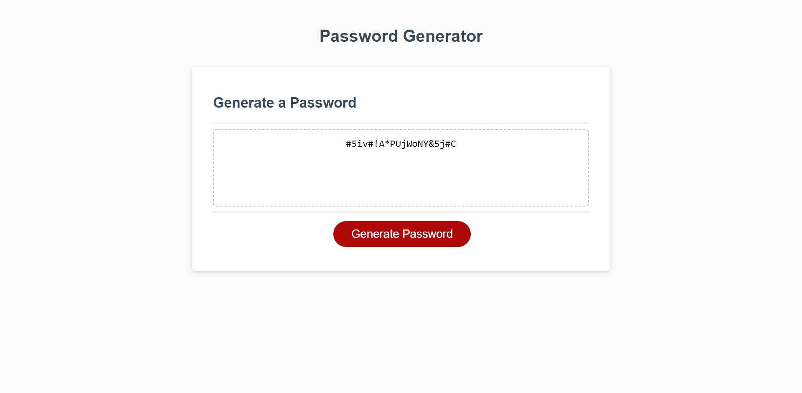

# Password Generator Initiated: By Hunter Johnson

The following assignment was a great challenge that incorperated the skills of Javascript in form of developing a password generator. This required us to work by adding everything from variables, datatypes, loops, functions, and if statements to produce a funtioning browser generator. 
